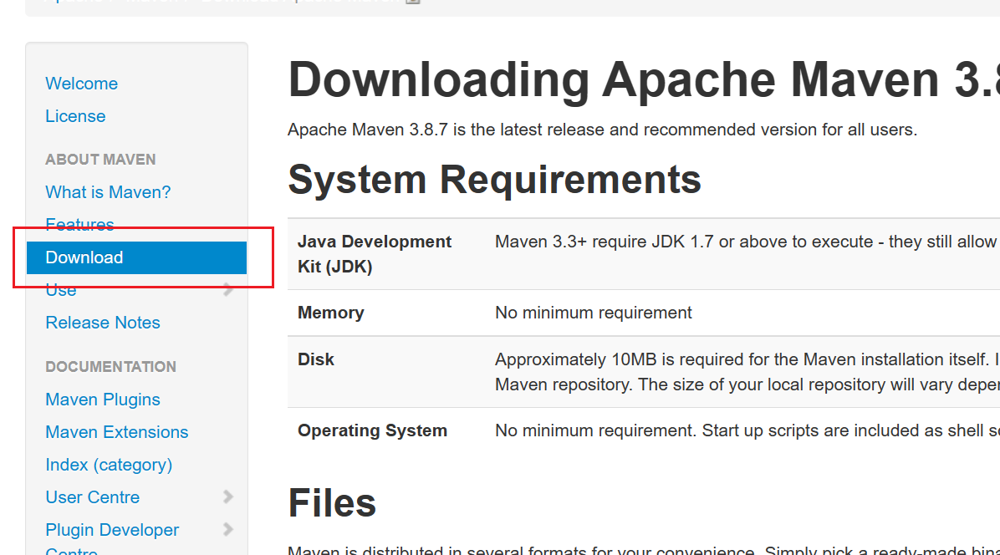
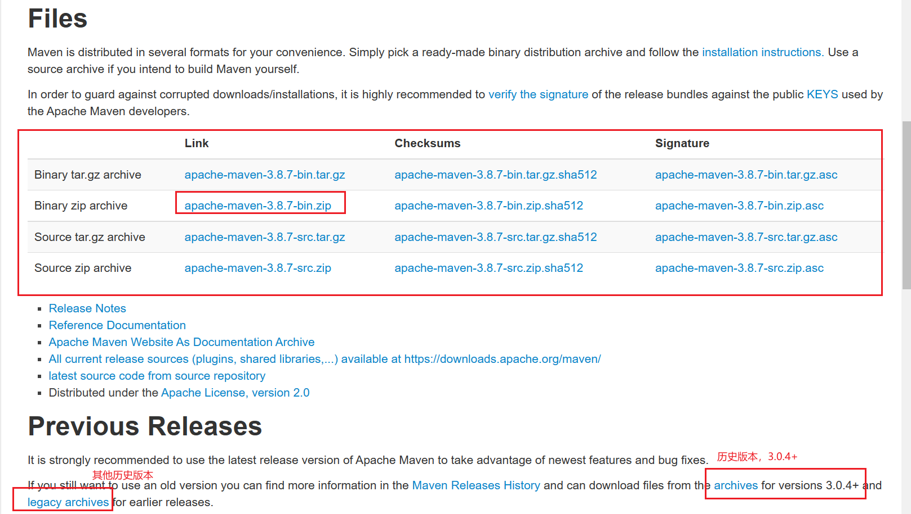
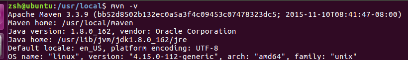

## 安装

**1. 进入官网 -->Dwonload**

官网：http://maven.apache.org/




**2.选择需要的版本下载， 建议下载apache-maven-3.3.9。一般下载apache-maven-版本号-bin.zip**




**3.下载好后上传到虚拟机，然后进行解压**

```
sudo tar -zxvf apache-maven-3.3.9-bin.tar.gz -C /usr/local
cd /usr/local
sudo mv apache-maven-3.3.9 maven
sudo chown -R zsh:zsh maven
```


**4.配置环境变量**

```
 vim ~/.bashrc
```

将如下内容写入到 `.bashrc` 文件中

```
export PATH=$PATH:/usr/local/maven/bin
```

保存退出，执行如下命令，让配置立即生效

```
source ~/.bashrc
```


**5.验证**

```
mvn -v
```

出现如下信息，说明安装成功




## 设置本机仓库位置

```
sudo vim /usr/local/maven/conf/settings.xml
```

找到如下注释

```xml
  <!-- localRepository
   | The path to the local repository maven will use to store artifacts.
   |
   | Default: ${user.home}/.m2/repository
  <localRepository>/path/to/local/repo</localRepository>
  -->
```

将 `<localRepository>/path/to/local/repo</localRepository>` 复制到注释外，将路径改为自定义的。**注意，路径中不要有中文，路径分割符用 `/` 。**如下：

```xml
  <!-- localRepository
   | The path to the local repository maven will use to store artifacts.
   |
   | Default: ${user.home}/.m2/repository
  <localRepository>/path/to/local/repo</localRepository>
  -->
  <localRepository>/home/zsh/maven_repository</localRepository>
```


## 配置阿里云镜像

找到未在注释标签内的mirrors，大约在145行左右，接着我们往mirrors标签内添加阿里云镜像

```xml
<mirror>
	<id>alimaven</id>
	<mirrorOf>central</mirrorOf>
	<name>aliyun maven</name>
	<url>http://maven.aliyun.com/nexus/content/repositories/central/</url>
</mirror>
```


