## 安装配置

**更新软件包**

```
sudo apt update
```


**安装 mysql**

```
sudo apt install mysql-server
```

出现如下提示，输入 `Y` 继续

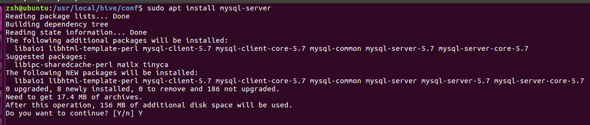


之后可能会出现如下窗口，提示设置 root 密码。这里输入密码，点击 `ok`

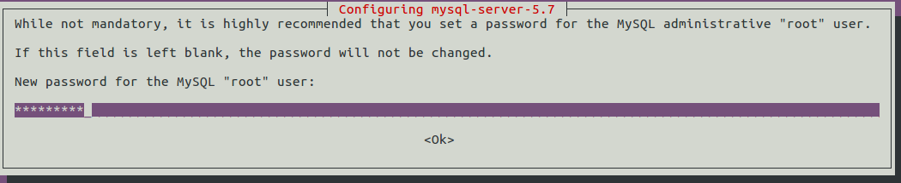

翻译后

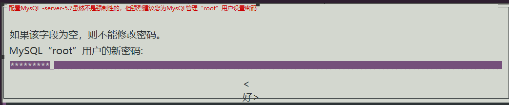


然后确认密码，等待安装完成。

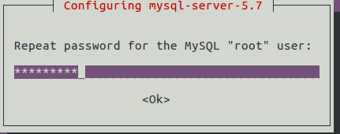


**配置安全设置**

```
sudo mysql_secure_installation
```

如果安装时有设置 root 密码，执行这个命令后会要求确认 root 密码，输入密码后继续：

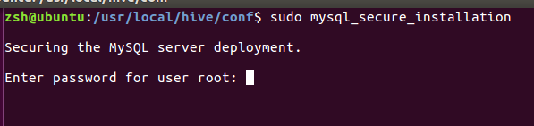


询问是否要对密码验证组件进行配置，输入 `Y` 继续。如果安装时没有设置 root 密码，会跳过上一步到这里。

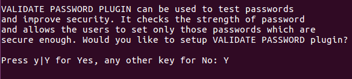


询问强制密码强度，根据自己需求设置。本文档设置为0，即密码长度>=8。

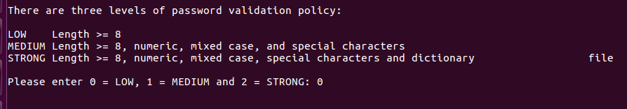


如果安装时没有设置 root 的密码，那么执行完上一步后会要求为 root 设置密码。

如果安装时设置了 root 密码，会询问是否需要修改 root 密码，本文档选择不修改。

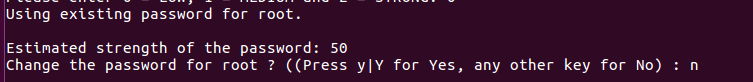


询问是否移除匿名用户，输入 `Y` 继续。

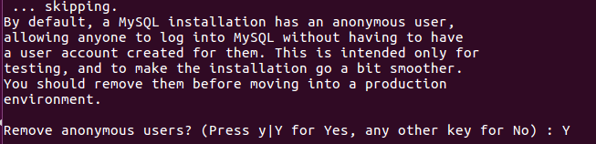


询问是否禁止 root 用户远程登录，输入`Y` 继续。

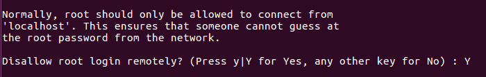


询问是否移除测试数据库。为了便于后续验证 mysql 是否安装成功，这里选择不移除。

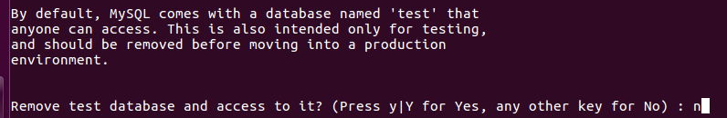


询问重载权限表(设置立即生效)，输入 `Y` 继续。


至此设置完成。


## 验证

查看 mysql 是否正在运行

```
systemctl status mysql.service
```

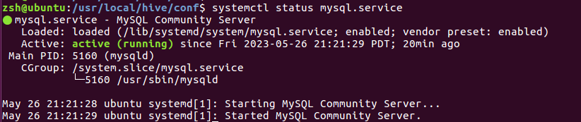


连接 mysql

```
sudo mysql -u root -p
```

确认密码后，进入mysql 提示符界面(命令行)，说明连接成功

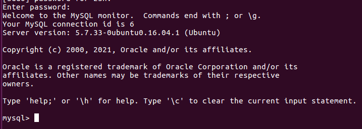


查询已有数据库

```
show schemas;
```

会看到以下 mysql 自带的数据库。

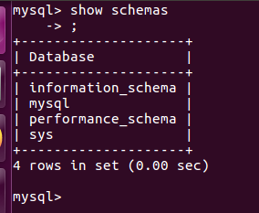
